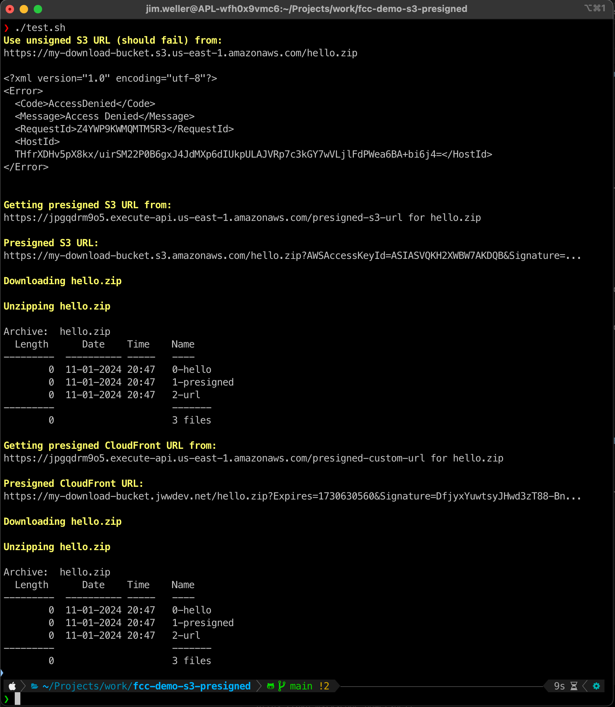

# AWS S3 and CloudFront Presigned URL Demo

This demo creates a simple architecture that represents a potential flow of
package downloads. There are two "channels." The API channel to generate time
boxed, secure, presigned download URLs. And the data channel for downloading
packages from an S3 bucket.

## Architecture

There are two solution options, S3 presigned and CloudFront presigned.

Packages are stored on an S3 bucket.

The S3 is NOT publicly available. Access is only available through presigned keys.

Both methods are the same use case and pattern with different technical implementations. The pattern is:

1. The actor (user or agent) makes an API call to request an presigned, time boxed URL to use for downloading a package
2. The actor uses the resulting URL to securely download a package before the timeout expires

The S3 method (`/presign-s3-url`)calls a lambda that uses the S3 APIs to
generate the URL. This is native to S3. Hostnames will vary by region or S3
bucket.

The CloudFront method (`/presign-custom-url`)  calls a lambda that uses an RSA
key trusted by the CloudFront distribution. The key is used to generate the
URL. The key is kept in Secret Manager. The Key ID is kept in SSM Parameter
Store. This pattern allows for a single ExampleCo host name. This is effectively a
facade on S3.

Traffic is enrypted. Both methods use HTTPS with TLS with certificates with
trusted chains. S3 uses native AWS urls and certificates. CloudFront uses an AWS
Certificate Manager (ACM) certificate. ACM automatically generates and rotates
the certificate.

Storage is encrypted. The S3 bucket has encryption enabled.

## Usage

Assume aws credentials on the console. Run test.sh or test.ps1 (assuming the
terraform is applied).

## Notes

- S3 Presigned URLs
  - Multiple domain names for customers to allow-list
  - AWS domain names
  - global geography is more difficult
  - simple to generate
  - less expensive

- CloudFront Presigned URLs
  - Single domain name for customers to allow-list
  - ExampleCo domain name
  - global geography is built in (caching, proximity, etc.)
  - more steps to generate
  - more expensive

There is another solution option, [hosting a private S3 VPC endpoint in a
VPC](https://aws.amazon.com/blogs/networking-and-content-delivery/hosting-internal-https-static-websites-with-alb-s3-and-privatelink/)
and fronting it with a load balancer. I consider this less cloud native (more
brittle, less features, harder to scale, more complex, etc.).
